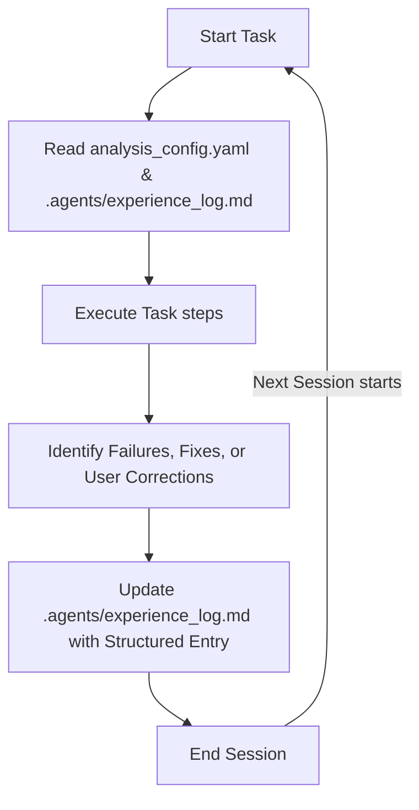

# Agentic Self-Learning and Continuous Persistence Protocol

This protocol defines the mechanism by which agents operating in this workspace self-learn from execution sessions, capture feedback/corrections, and persist these learnings to optimize future tasks across separate sessions.

---

## 1. The Learning Mechanism

To enable cross-session memory and self-learning without modifying the underlying LLM weights, the agents utilize a **Workspace Memory Ledger** at [.agents/experience_log.md](file:///Users/nishantagarwal/Documents/Data%20Analysis%20Engine/.agents/experience_log.md).

### The Feedback Loop


---

## 2. Reading Protocol (Start of Session)

Every agent, upon initiating a task in this workspace, **MUST** check for the existence of [.agents/experience_log.md](file:///Users/nishantagarwal/Documents/Data%20Analysis%20Engine/.agents/experience_log.md):
1. If the file exists, read its contents.
2. Check for any patterns, pitfalls, or specific rules recorded from past sessions that apply to the current step (e.g., specific pandas parsing parameters, chart styling, or mathematical edge cases).
3. Explicitly state in the agent's internal reasoning: *"Retrieved past learnings on [Topic X] from experience log; applying the following correction..."*

---

## 3. Writing Protocol (End of Session / On-the-fly Correction)

An agent **MUST** update the [.agents/experience_log.md](file:///Users/nishantagarwal/Documents/Data%20Analysis%20Engine/.agents/experience_log.md) when:
1. A python command or script errors, and the agent determines a non-trivial fix (e.g., date-parsing workaround, handling NaN values in log calculations).
2. The user provides a correction, critique, or preference (e.g., "always use standard Z-score threshold of 2 instead of 3", "save charts in PNG with a transparent background").
3. A successful validation or analysis is completed, revealing a reusable optimization pattern.

### Log Entry Schema
Each entry appended to [.agents/experience_log.md](file:///Users/nishantagarwal/Documents/Data%20Analysis%20Engine/.agents/experience_log.md) must follow this template:

```markdown
### [YYYY-MM-DD] Learning Event - [Short Descriptive Title]
- **Context/Task**: [e.g., Trend Analysis breakpoint detection]
- **Triggering Event**: [e.g., User correction, code execution error, or algorithm optimization]
- **Problem/Pitfall**: [Detailed explanation of what went wrong or was sub-optimal]
- **Resolution/Correct Action**: [The verified fix or user-requested configuration]
- **Persistent Rule for Future Agents**:
  > [!IMPORTANT]
  > [Clear, imperative rule that future agents should check and execute to avoid this problem]
```

---

## 4. Maintenance & Ledger Pruning

- Periodically, the lead orchestrator agent (or hypothesis generator) will consolidate overlapping or redundant entries to keep the ledger concise and fit within LLM context constraints.
- Learned rules that are universal to the project should eventually be promoted directly to [.agents/AGENTS.md](file:///Users/nishantagarwal/Documents/Data%20Analysis%20Engine/.agents/AGENTS.md) as project-scoped guidelines.
